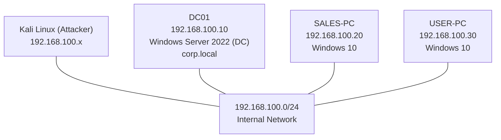
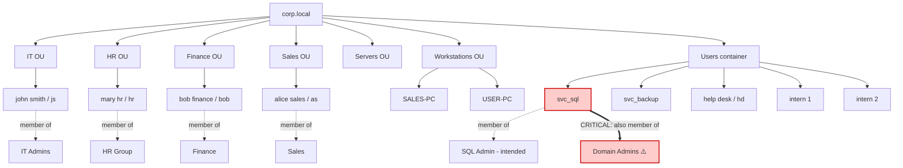
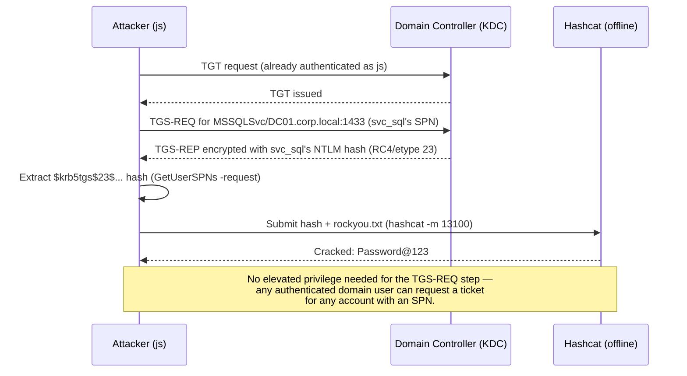
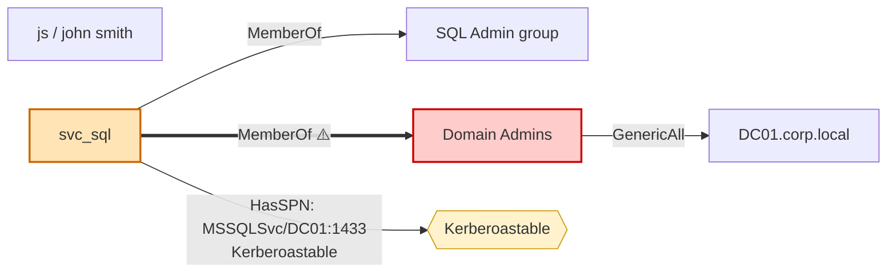
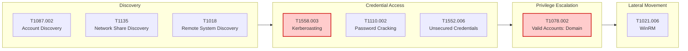

# Diagram Recreation Instructions

These are text-based specifications so each diagram can be recreated in draw.io, Excalidraw, Mermaid, or any diagramming tool. Mermaid code blocks are included where the diagram type supports it directly.

---

## 1. Network Diagram

**Layout:** Star topology. One central "Attacker" node (Kali Linux) connected via a shared internal switch/subnet to three target nodes.

**Nodes:**
- Kali Linux (Attacker) — `192.168.100.x` — icon: Linux penguin or terminal
- DC01 — `192.168.100.10` — Windows Server 2022, Domain Controller — icon: server with AD logo/shield
- SALES-PC — `192.168.100.20` — Windows 10 workstation — icon: desktop PC
- USER-PC — `192.168.100.30` — Windows 10 workstation — icon: desktop PC

**Connections:** All four nodes connect to a central "192.168.100.0/24 (Internal Network)" switch/cloud shape. Label the connecting network segment.

**Annotations:** Add a small note near DC01: "SMB Signing: Enabled | SMBv1: Disabled." Add a note near the network cloud: "Isolated VirtualBox host-only/internal network — no external routing."

---

## 2. Active Directory Architecture Diagram

**Layout:** Top-down organizational tree.

**Level 1 (root):** `corp.local` domain

**Level 2 (OUs):** IT | HR | Finance | Sales | Servers | Workstations | Managed Service Accounts | Users (default container)

**Level 3 (objects under each OU):**
- IT → `john smith (js)` → member of **IT Admins**
- HR → `mary hr (hr)` → member of **HR Group**
- Finance → `bob finance (bob)` → member of **Finance**
- Sales → `alice sales (as)` → member of **Sales**
- Servers → (computer objects — none custom beyond DC01)
- Workstations → `SALES-PC`, `USER-PC`
- Users (default) → `Administrator`, `Guest`, `help desk (hd)`, `intern 1`, `intern 2`, `svc_backup`, `svc_sql`, `krbtgt`

**Highlight box:** Draw `svc_sql` with a red/warning-colored border and a dual arrow showing it belongs to **both** `SQL Admin` (intended scope) **and** `Domain Admins` (unintended/critical finding). This dual-membership visual is the single most important element of this diagram.

---

## 3. Attack Flow Diagram

**Layout:** Left-to-right (or top-to-bottom) swimlane/sequence showing 10 stages.

```mermaid
flowchart LR
    A[1. Initial Access<br/>js:Password123!] --> B[2. SMB/LDAP/AD<br/>Enumeration]
    B --> C[3. BloodHound<br/>Collection]
    C --> D[4. BloodHound Analysis:<br/>Kerberoastable Accounts Query]
    D --> E[5. Kerberoasting<br/>impacket-GetUserSPNs]
    E --> F[6. Offline Cracking<br/>hashcat + rockyou.txt]
    F --> G[7. Recovered Password<br/>svc_sql:Password@123]
    G --> H[8. WinRM Access<br/>evil-winrm]
    H --> I[9. Privilege Confirmation<br/>whoami /all → Domain Admins]
    I --> J[10. Post-Exploitation<br/>Enumeration]

    style D fill:#ffe4b5,stroke:#cc6600
    style I fill:#ffcccc,stroke:#cc0000,stroke-width:2px
```

**Annotation:** Mark step 4 (BloodHound Analysis) as the "decision point" and step 9 (Privilege Confirmation) as "Full Domain Compromise" in a distinct color (as shown above).

---

## 4. Kerberoasting Workflow Diagram

**Layout:** Sequence diagram between three actors: Attacker, Domain Controller (KDC), Offline Cracking Host.

---

## 5. BloodHound Privilege Path Diagram

**Layout:** Directed graph, matching the actual BloodHound visualization captured in the lab.

**Caption:** "BloodHound's 'Shortest Path to Domain Admins from Kerberoastable Users' query returns a single-hop result: `svc_sql` is both Kerberoastable and a direct member of Domain Admins."

---

## 6. MITRE ATT&CK Flow Diagram

**Layout:** Horizontal kill-chain style, one box per tactic (top row), technique beneath each.

